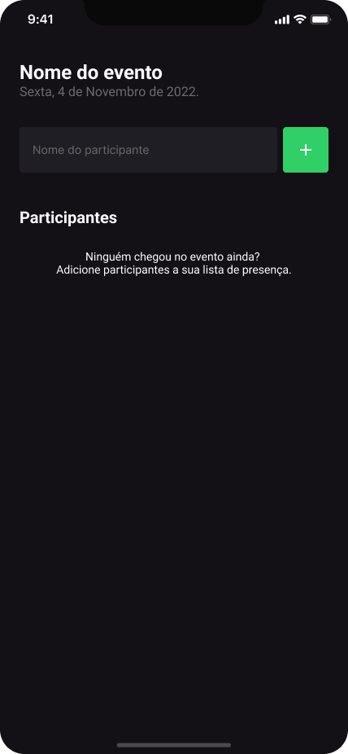

<h1 align="center">
     ✅ <a href="#" alt="aplicativo do imhere"> Im Here </a>
</h1>

<h3 align="center">
    ✔ Projeto Im Here. Aplicação para gerenciar os participantes presentes em eventos, como em palestras e workshop. 🕒
</h3>

<h4 align="center">
	🚧   Concluído 🚀 🚧
</h4>

Tabela de conteúdos
=================
<!--ts-->
   * [Sobre o projeto](#-sobre-o-projeto)
   * [Funcionalidades](#-funcionalidades)
   * [Layout](#-layout)
     * [Mobile](#mobile)
     * [Web](#web)
   * [Como executar o projeto](#-como-executar-o-projeto)
     * [Pré-requisitos](#pré-requisitos)
     * [Rodando o Backend (servidor)](#user-content--rodando-o-backend-servidor)
     * [Rodando a aplicação web (Frontend)](#user-content--rodando-a-aplicação-web-frontend)
   * [Tecnologias](#-tecnologias)
     * [WebSite](#user-content-website--react----typescript)
     * [Server](#user-content-server--nodejs----typescript)
     * [Mobile](#user-content-mobile--react-native----typescript)
   * [Contribuidores](#-contribuidores)
   * [Como contribuir no projeto](#-como-contribuir-no-projeto)
   * [Autor](#-autor)
   * [Licença](#user-content--licença)
<!--te-->

## 💻 Sobre o projeto
✅ ImHere - é uma aplicação para gerenciar os participantes presentes em eventos, como em palestras e workshop.

Projeto desenvolvido durante a especialiação da [Rocketseat](https://www.rocketseat.com.br/) em React Native.
A Rocketseat é uma plataforma de educação em tecnologia onde você encontra tudo o que precisa para progredir na programação e alcançar seus objetivos no menor tempo possível

---

## ⚙️ Funcionalidades

- [x] Os usuários tem acesso ao aplicativo móvel, onde podem:
  - [x] adicionar novos participantes ao evento
  - [x] remover participantes do evento
  - [x] listar participantes presentes

---

## 🎨 Layout

O layout da aplicação está disponível no Figma:

### Mobile

  
 
  

### Web
